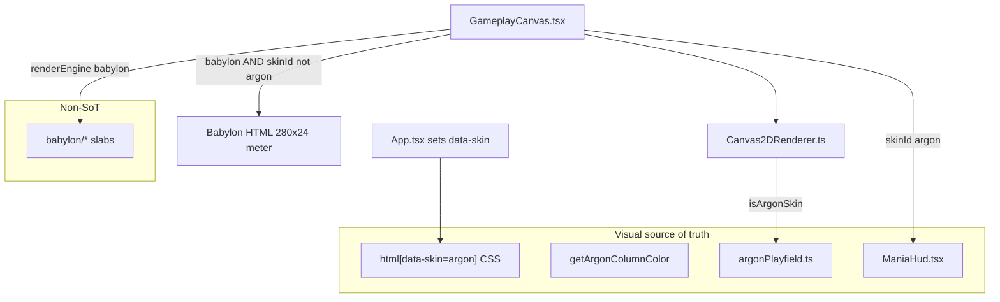

# RhythmMania Lazer Visual Replication Plan (Argon)

| Field | Value |
|---|---|
| **Title** | Recreating osu!(lazer) Argon visuals in RhythmMania |
| **Author** | TBD |
| **Date** | 2026-09-11 |
| **Status** | Draft (rev 4, user answers) |
| **Product version (source of truth)** | `metadata.json` / `index.html` form `v0.9.8`; `package.json` `"version": "latest"` |
| **Workspace** | `RhythmMania-Beta` only — do not touch sibling `rhythm-mania` |
| **Supersedes (visual surfaces)** | `DESIGN.md` arcade/cyan language **only while `data-skin="argon"`** for play, song select, results, pause, main menu, HUD. `DESIGN.md` remains valid for **legacy skins** (`rhythmmania`, `rhythmplus*`, `circle`) and the Skins screen chrome until those surfaces are retokened. |
| **Role vs `plan.md`** | Geometry/spec appendix. `plan.md` is the living agent plan: TASK-001–082 done, remaining **TASK-V-*** queue, kept product prefs, PENAR/latency, future TASK-090+. This file stays **visual/UI/playfield only**. |

---

## Overview

RhythmMania already ships a substantial original recreation of osu!(lazer) **Argon**: procedural Canvas2D notes/holds/receptors (`src/render/argonPlayfield.ts`), public colour APIs (`getArgonColumnColor` / `argonPaletteForKeyCount` in `src/render/argonSkin.ts`), an HUD that matches `ArgonSkin.cs` corner placement (`src/components/ManiaHud.tsx`), pause/fail overlays with GameplayMenuOverlay IA, results judgement **display** names, and Song Select that is structurally V2-ish (left metadata, carousel, Local board, footer). Remaining work is **gap-only**: filled rice-arrow vs current **stroke** chevron, optional hold taper and lane dim, **note-histogram song-progress density**, Song Select wedge geometry, token scoping so legacy skins are not restyled, and results **layout** QA once stills exist.

The product constraint is legal and brand: **recreate Argon with original canvas/CSS**. Do not copy `osu-resources` bitmaps, the osu! wordmark, pink-circle mark, or Torus as a branded drop-in. The product name stays RhythmMania. A HUD *slot* for a performance number exists and is labelled **PENAR**, never `pp`. Pixel-perfect vs `osu.exe` is not required. Fail conditions: wrong HUD corner, slab notes, stable-client chrome, Global/RM boards instead of Local ranking, shipping osu! branding.

---

## Background & Motivation

### Why visual replication (without copying assets)

Players coming from lazer expect Argon’s **line-based, procedural** language: short notes with a bright lip and arrow, darkened hold tails, 4K yellow/orange/pink/purple columns, cyan-accent wedges behind score, combo bottom-left, accuracy + performance top-right, dual hit-error bars, bottom song progress. RhythmMania’s older `DESIGN.md` language (cyan arcade, Space Grotesk) still appears on shared screens that are not skin-gated.

### Current state (honest inventory)

Verified against executable source, not `AGENTS.md` or `plan.md`.

| Surface | Implementation | vs Argon target | Verdict |
|---|---|---|---|
| **Playfield Canvas2D** | `renderArgonPlayfield`. **Already drawn:** `roundRect` notes h=42, accent 0.82, white lip; **stroked** chevron rice (`drawChevronDown`, halfW=0.38×size, halfH=0.22×size, lineWidth max(2, 0.12×size)); hold-head bar; hold-tail darkened accent; hold body `argonDarken(color, 0.6)`, failed `rgb(48,52,64)`, additive pulse; receptor `roundRect` + white lip; **oval key lights** (ovalW min(22, 0.42×width), ovalH=14). Colour API: `getArgonColumnColor` (private table `ARGON_LAYOUT`, 1–10 keys). | Not missing receptors/ovals/tails. Remaining: **filled vs stroke arrow**; optional **hold taper**; **lane dim/cover** vs `argon-notes.png`. | **Close — TASK-V-050 / V-051 polish only** |
| **Playfield Babylon** | `src/render/babylon/` slabs. HTML hit-error 280×24 shown only when `renderEngine === 'babylon' && skinId !== 'argon'` (`GameplayCanvas.tsx`). | Optional; not Argon SoT. Mixed engine+skin: see Key Decisions. | **Out of Argon SoT** |
| **HUD** | Health, wedges 380×72 shear 0.8 `#66CCFF`, score 6-digit, accuracy, PENAR under acc, combo `scale-125 sm:scale-[1.3]`, dual 24×200 meters, key boxes, **CSS width pill progress (no density series)**. | Anchors match pinned `ArgonSkin.cs`. Real gap: **density graph**. Combo/PENAR scale already shipped. | **Close — TASK-V-052 density; V-053 still-diff only** |
| **Pause / fail** | 200ms fade, reduced-motion 0, yellow title, stacked Continue / Retry / **Quit** (`h-[80px]`, 2px gap, green/amber/red). | IA already GameplayMenuOverlay-like. Gap: display **Quit** vs board/lazer **Exit**. Do not rebuild buttons. | **Structure pass; TASK-V-043 copy + still-diff** |
| **Song Select** | Left ~480–520px, carousel, **Local** only, footer Back/Mods/Random/Options. | No sheared wedge. 390×844 must not clip hit targets. | **IA close; TASK-V-060 geometry** |
| **Mods / catalog** | Category overlay; catalog is RM product UI. | Token/chip chrome only. | **TASK-V-062** |
| **Results** | Grade ring; display names **Perfect / Great / Good / Ok / Meh / Miss** (internal marvelous→Perfect in `ResultsScreen.tsx` only); HitErrorGraph; Retry/Replay/Back; PENAR slot. | **No still** in `results/` yet. User will send shipped-lazer captures. Do not change `scoreProcessor.ts`. Not Figma. | **TASK-V-070 gated on `docs/visual-refs/argon/results/`** |
| **Main menu** | Stacked actions; particle/logo pulse already gated on `prefers-reduced-motion`. | Gap-only vs `task080-*` stills. | **TASK-V-080 still-diff** |
| **Skins / settings** | Argon default; `--settings-*` tokens. | Copy that 3D ≠ Argon. | **TASK-V-090 copy** |

Local `verify-*.png` files are **our** output. Compare to `docs/visual-refs/argon/` slots.

### Pain points

1. Shared screens (select/results/menu) are not skin-scoped — a global `--argon-*` restyle would hit legacy skins.
2. Results QA blocked on missing lazer stills.
3. Song progress has elapsed width only; no density buffer.
4. Babylon + leftover `skinId: 'argon'` must not double-draw meters (already gated; document it).

---

## Goals & Non-Goals

### Goals

- Default Argon Canvas2D + HUD + Song Select V2 + pause + results read as lazer Argon at 1280×720 and 390×844.
- Skin-scoped tokens (`html[data-skin="argon"]`).
- Canvas2D as visual SoT; Babylon optional.
- Serial **TASK-V-xxx** IDs **aligned with the visual-ref board** (050 playfield, not results).
- Original geometry; licensed fonts already in `index.css` unless a later type PR is approved.

### Non-goals

- Judgement windows, hold-tick rules, HP, DT/HT *timing*, PENAR *computation*, replay verification, Global boards.
- Renaming judgements in `src/ruleset/mania/scoreProcessor.ts` (display map already in `ResultsScreen.tsx`).
- Pixel-perfect vs osu.exe / osu-resources.
- Skin editor; `.osk`; Torus; osu! wordmark.
- Babylon Argon silhouettes in this workstream.
- Re-implementing pause button stack, combo 1.3 scale, oval keys, or results name column.

---

## Key Decisions

1. **Canvas2D Argon is the visual source of truth.** `renderArgonPlayfield` runs when `isArgonSkin(settings)` is true:

   ```ts
   // src/render/argonSkin.ts
   playfieldStyle === 'circle' → false
   squareRenderStyle === 'rhythmplus' | 'rhythmplus-dynamic' → false
   otherwise → !skinId || skinId === 'argon'
   ```

   Babylon remains `renderEngine: 'babylon'` / `rhythmmania-3d`. **HUD/meters when engine and skin disagree:**
   - `skinId === 'argon'` → `ManiaHud` dual vertical meters; Canvas2D legacy timing bar skipped (`Canvas2DRenderer` `skinId !== 'argon'`).
   - Babylon HTML 280×24 meter: only `renderEngine === 'babylon' && skinId !== 'argon'` (`GameplayCanvas.tsx` ~4182).
   - Therefore `babylon` + leftover `skinId: 'argon'` uses **Argon HUD meters**, not the Babylon canvas meter. That is intentional: Argon HUD wins. `rhythmmania-3d` typically sets both engine and non-argon skinId.

2. **Default skin stays `argon`.** `DEFAULT_SKIN.id`, `App.tsx` fallback `skinId: updated.skinId || 'argon'`.

3. **Typography: Inter / Space Grotesk / JetBrains Mono (user-confirmed).** Torus is forbidden. TASK-V-002 (Outfit) stays **optional/unstarted** unless later stills demand it. Do not ship a font swap in the token PR.

4. **PERFORMANCE HUD slot labelled PENAR, never pp.** Position already under accuracy, ~0.8 scale.

5. **Song Select target is V2** (user-confirmed). V1 stills are contrast only.

6. **Results: shipped lazer client structure** (user-confirmed). Figma redesign is **not** TASK-V-070; optional **TASK-V-070b** only if we ever do it later. Display names already Perfect→Miss in `ResultsScreen.tsx`. Frozen: **no processor changes**. Do **not** start TASK-V-070 until stills are in `docs/visual-refs/argon/results/`.

7. **`DESIGN.md` coexistence via `html[data-skin="argon"]`** set from `App` when `isArgonSkin` would be true for current settings (or `skinId === 'argon'` for non-play screens). Legacy skins keep arcade tokens on shared routes.

8. **No osu-resources, no wordmark.**

9. **Colour API is `getArgonColumnColor` / `argonPaletteForKeyCount`, not the private `ARGON_LAYOUT` const.** Runtime keys **1–10** (`src/utils/keyCounts.ts`). QA: **4K primary** plus at least **7K and 9K** in **TASK-V-050 / PR-V2** (no separate TASK-V-012). Do not redesign the table.

10. **Motion:** overlay fade **200ms**; `prefers-reduced-motion` → 0 (already pause + main-menu particles). New overlays use `--argon-motion` under `data-skin="argon"`.

11. **Pause third button display string: `Exit`** to match board pass/fail and lazer. Keep `onExit` / `pause-quit-btn` ids if renaming ids is churn; visible label becomes Exit. Do not rebuild the stack.

12. **Song-progress density is a client typed buffer**, not a DB/settings change. Histogram bins are in **map time** (rate-invariant). DT/HT only move the elapsed clip. See Data Model (client).

---

## Proposed Design

### Visual system (tokens)

Scoped:

```css
html[data-skin="argon"] {
  --argon-accent: #66ccff;
  --argon-accent-rgb: 102, 204, 255;
  --argon-wedge-radius: 10px;
  --argon-motion: 200ms;
}
html[data-skin="argon"] .argon-wedge /* etc. */
@media (prefers-reduced-motion: reduce) {
  html[data-skin="argon"] { --argon-motion: 0ms; }
}
```

`--skin-accent` (`#00b0ff`) stays for legacy/arcade. Argon HUD should consume `--argon-accent` **inside the scoped root**, replacing hardcoded `#66CCFF` only when `data-skin="argon"`.

Mania column colours: `getArgonColumnColor(keyCount, i)` — 4K `#ffc528` `#fc6d01` `#d5235a` `#cb3cec`.

### Architecture



### Canvas2D Argon playfield (remaining delta)

**Already implemented — do not re-add:** darkened holds, failed colour, pulse, head bar, tail variant, receptor glow + lip, oval keys.

**TASK-V-050 + TASK-V-051 land in one PR (PR-V2).** Do not split lane dim across two PRs.

**TASK-V-050 — filled rice arrow:** replace `drawChevronDown` **stroke** with a **filled** chevron/arrow polygon using the **same parameters as today**:

```ts
size = Math.min(20, noteW * 0.42);
halfW = size * 0.38;  // full glyph width = 2 * halfW
halfH = size * 0.22;
```

White fill; no second shrink of `0.38 * min(...)`. Pass: silhouette matches `playfield-4k/argon-notes.png` / `lazer-argon-mania-gameplay.png` within **~4 px** at 1280×720 on 4K. Verify **4K plus 7K and 9K** column colours in the same PR (no table edits).

**TASK-V-051 — still-diff ovals + optional taper + lane dim (same PR-V2):**
- Compare oval/receptor stills; tweak sizes only if >4 px off.
- Optional hold-body taper (visual; segments still from `mergeVisibleTailSegments`).
- Lane dim/cover: only here (with V-050 in PR-V2), currently `argonDarken(color, 3)` @ 0.8 alpha vs `argon-notes.png`.

### HUD — song progress density (TASK-V-052)

Current `ArgonSongProgress` is elapsed **width %** via `progressBarRef` only.

**Client contract (no PostgreSQL, no settings keys):**

```ts
/** length DENSITY_BIN_COUNT, values in [0, 1]; map-time histogram */
densityBins: Float32Array;
/** 0..1 fill cursor on the playback clock (existing progress). Not used for binning. */
densityElapsedRatio: number;
```

Hit-object `time` is **map milliseconds** (`src/types.ts`). Audio length is the same unrate-adjusted axis. DT/HT change `playbackRate` (1.5 / 0.75) and **wall-clock** duration only.

| Item | Spec |
|---|---|
| Source | Loaded beatmap hit objects: rice `time`; holds contribute **one** count at `time` (not per tick). |
| Bin domain | **Map time, rate-invariant.** `audioDuration` = decoded/map audio length in map ms. If audio length is missing, use `max(object.time)` (hold `endTime` if present). |
| Bins | `DENSITY_BIN_COUNT = 64`. `bin = floor(t_map / audioDuration * 64)` clamped to `0..63`. **Do not** divide duration by `playbackRate`. |
| Weight | 1 per object. Normalize by max bin count so peak = 1. Empty map → zeros. |
| Compute site | **Once on beatmap identity** (unpack/select). **Do not** rebuild bins on DT/HT. Owner: `GameplayCanvas`. |
| Elapsed clip | Bright “past” uses existing gameplay progress (`progressBarRef` / `densityElapsedRatio` = `gameplayTime / (audioDuration / playbackRate)`). Histogram shape stays fixed; only the clip moves under DT/HT. |
| Prop | `ManiaHudProps.densityBins?: Float32Array` → `ArgonSongProgress`. |
| Draw | **One** `<canvas>` inside the pill. Past: additive white; future: dim tint. Time labels unchanged. No per-note DOM. |
| Perf | 64 rects/frame max. |

### Song Select V2 wedge (TASK-V-060)

| Viewport | Geometry |
|---|---|
| 1280×720 | Left metadata **width stays 480–520px**. Decorative **parallelogram clip** or `skewX(-8deg)` on a **background layer only** (shear ~0.14, similar family to HUD wedge 0.8 but **much milder** so text stays upright). Interactive controls remain **axis-aligned**. Pass: left edge reads as a wedge vs `lazer-song-select-v2.png` within ~8 px at the top-left corner. |
| 390×844 | **No shear** (or shear opacity 0). Full-width stack; no clip of Back/Mods/play. |

Implementation default: **clipped parallelogram / SVG backdrop** (like `ArgonWedgePieces`), not skewing the text tree (Alternative G).

### Pause

Keep stack. Change visible **Quit → Exit**. Still-diff vs `docs/visual-refs/argon/pause/`.

### Results

No scoring work. After user **shipped-lazer** stills land in `docs/visual-refs/argon/results/`: align grade ring size/position only. Not the Figma redesign.

---

## API / Interface Changes

No HTTP API.

**DOM:** `App.tsx` sets `document.documentElement.dataset.skin` to `'argon'` or `'legacy'`.

**ManiaHud / GameplayCanvas:** add `densityBins: Float32Array` (length 64).

**Renderer contract unchanged** (`IPlayfieldRenderer`).

---

## Data Model Changes

**PostgreSQL / GameSettings / localStorage: none.**

**In-memory client (required for density):**

- `DENSITY_BIN_COUNT = 64`
- `Float32Array` on the live gameplay props
- Recomputed **only** on beatmap identity (not DT/HT)

Do not describe this as “no data model”; it is **not** a persistence model.

---

## Alternatives Considered

### A. Sprite-based Argon (osu-resources)

Rejected: legal fail.

### B. Babylon as Argon SoT

Rejected: slabs, different projection, default is Canvas2D.

### C. Arcade DESIGN.md as default

Rejected: default `skinId` is already `argon`.

### D. Keep stroke chevron vs filled polygon

**Default: filled polygon (TASK-V-050).** Stroke is the current gap vs stills. Keep stroke only if filled looks heavier than Argon pieces at 4K.

### E. CSS gradient fake-density vs note histogram

**Default: histogram (`Float32Array`) in map time.** Fake CSS cannot match PR #22144 segmented stills. CSS-only is a fallback if beatmap notes are unavailable (zeros + elapsed pill). Do not bin in wall-clock / `duration/rate` space.

### F. Outfit vs keep Inter/Space Grotesk

**User-confirmed: keep Inter / Space Grotesk / JetBrains Mono.** TASK-V-002 remains optional/unstarted. Avoid brand churn in PR-V1.

### G. Song Select shear: CSS skew vs clip vs SVG wedge

**Default: SVG/clip backdrop, axis-aligned hit targets.** CSS `skew` on the whole column fails 390×844 and a11y.

---

## Security & Privacy Considerations

- Visual-ref PNGs stay in `docs/` — never `public/`.
- No osu-resources.
- Density uses already-loaded local beatmap times; no new network.

| Severity | Risk | Mitigation |
|---|---|---|
| High | Asset copy | Procedural checklist per PR |
| Medium | Wedge clip on mobile | 390×844: no shear |
| Low | Double hit-error | Argon HUD wins when `skinId === 'argon'` |

---

## Observability

Playwright screenshots vs slots. `npm run lint` and `npm test` on playfield/HUD PRs (`tests/argon-skin.test.ts`, `tests/mania-hud.test.ts`). Density: no per-note DOM.

---

## Rollout Plan

1. Token scope `data-skin` (rollback: remove attribute).
2. Playfield filled arrow + optional dim (revert `argonPlayfield.ts`).
3. Density buffer + canvas (map-time bins; revert HUD props).
4. Song Select decorative wedge.
5. Pause label Exit.
6. Results after stills.
7. Tiny still-diff / copy PRs merged rather than stacked empty PRs.

Escape hatch: `skinId` → `rhythmmania` (and `data-skin=legacy`).

---

## Verification protocol

1. `npm run dev`
2. Playwright 1280×720 and 390×844
3. Side-by-side vs **board slot**, not vs `verify-*.png` as truth
4. Board pass/fail (corners, silhouettes, Local, no branding)

### ID mapping (do not collide)

| Board / filename | This workstream ID | Surface |
|---|---|---|
| TASK-050–051, `playfield-4k/task050-*` | **TASK-V-050, TASK-V-051** | Playfield |
| TASK-052–054, `hud/task052-*` | **TASK-V-052, TASK-V-053** | HUD |
| TASK-043–044, `pause/*` | **TASK-V-043** | Pause copy/still-diff |
| TASK-060–062, `song-select/task060-*` | **TASK-V-060, TASK-V-061, TASK-V-062** | Select / mods / catalog |
| TASK-070, `results/` | **TASK-V-070** | Results layout |
| TASK-080, `task080-*` | **TASK-V-080** | Main menu still-diff |
| (new) | TASK-V-001, V-002, V-090 | Tokens, optional type, skins copy |

**Never use TASK-V-050 for results.**

| Slot | Compare to | Capture gap |
|---|---|---|
| HUD | `hud/*` | Live lazer HUD still welcome |
| Playfield 4K | `playfield-4k/*` | 7K/9K extra shots |
| Song Select | `song-select/lazer-song-select-v2*` | — |
| Results | **NONE until user files land** | User will send shipped-lazer results (+ HUD/playfield). Gate TASK-V-070. |
| Pause | `pause/*` | No public Argon pause still |

---

## Serial visual-only task queue

| ID | Surface | Work | Verify |
|---|---|---|---|
| **TASK-V-001** | Tokens | `data-skin="argon"` + `--argon-*`; do **not** change fonts | lint |
| **TASK-V-002** | Type (optional, **unstarted**) | Outfit only if later stills demand it; fonts stay Inter/Space Grotesk | — |
| **TASK-V-050** | Playfield | Filled rice arrow vs stroke chevron; **7K/9K colour shots** (no table edits) | `playfield-4k` 1280+390, ~4 px |
| **TASK-V-051** | Playfield | Same PR-V2: oval still-diff, optional taper, **lane dim** | holds + `argon-notes.png` |
| **TASK-V-052** | HUD | Density `Float32Array` + canvas graph | `hud/argon-song-progress-*` |
| **TASK-V-053** | HUD | Still-diff only (combo 1.3 / PENAR already shipped) | `hud/task052*` |
| **TASK-V-043** | Pause | Label **Exit**; still-diff; **do not** rebuild buttons | `pause/` |
| **TASK-V-060** | Song Select | Decorative wedge; no shear at 390 | `song-select/v2*` |
| **TASK-V-061** | Footer | Chrome still-diff | v2 footer |
| **TASK-V-062** | Mods/catalog | Token/chip pass under `data-skin` | `task062*` |
| **TASK-V-070** | Results | Shipped-lazer layout vs user stills; **gated**; no `scoreProcessor`; not Figma | `docs/visual-refs/argon/results/` once files exist |
| **TASK-V-080** | Menu | Still-diff vs `task080-*`; pulse already reduced-motion | `task080*` |
| **TASK-V-090** | Skins | Copy: 3D is not Argon SoT | SkinScreen |

---

## Open Questions

**Resolved (user, 2026-09-11)**

1. **Results chrome:** **Shipped lazer** (not the in-progress Figma). TASK-V-070 is shipped-client structure only. Figma remains a later **TASK-V-070b** only if we ever do it — not in this workstream’s active queue.
2. **Song Select:** **V2** confirmed.
3. **Typography:** **Keep Inter / Space Grotesk** (and JetBrains Mono for digits). TASK-V-002 stays optional/unstarted unless stills later demand a change.

**Pending**

4. **User pictures:** User **will send** results + HUD/playfield stills. Do **not** start TASK-V-070 / PR-V7 until those files are in `docs/visual-refs/argon/results/` (HUD/playfield stills go in the existing `hud/` and `playfield-4k/` slots). Close-enough markup on `verify-*.png` can wait on those captures.

**Already frozen (not reopened)**

6. **Judgement labels:** display-only in `ResultsScreen.tsx`; not a scoring rename.

---

## References

Pinned GitHub (last commit touching path as of 2026-09-11):

- `ArgonSkin.cs`: https://github.com/ppy/osu/blob/12df2e4ff254975f4b66ae9efda808837ee9beea/osu.Game/Skinning/ArgonSkin.cs (`12df2e4ff254975f4b66ae9efda808837ee9beea`, 2026-08-07, PR #38269)
- `ManiaArgonSkinTransformer.cs`: same commit prefix on path `osu.Game.Rulesets.Mania/Skinning/Argon/ManiaArgonSkinTransformer.cs` (`12df2e4ff254975f4b66ae9efda808837ee9beea`)

PRs/issues (behavioural, not pinned files): #22402 holds, #22820/#23769/#21996 colours, #25226 HUD wedges, #24980 health, #22144 progress, #33462/#33902/#34040 Song Select V2, #24996 results tracker.

Local: `docs/visual-refs/argon/**`.

Implementation: `argonSkin.ts` (`isArgonSkin`, `getArgonColumnColor`), `argonPlayfield.ts` (`drawChevronDown`, ovals), `Canvas2DRenderer.ts`, `GameplayCanvas.tsx` (Babylon meter gate), `ManiaHud.tsx`, `PauseOverlay.tsx` (Quit label), `SongSelect.tsx`, `ResultsScreen.tsx` (display names), `MainMenu.tsx`, `keyCounts.ts` (1–10), `tests/argon-skin.test.ts`, `tests/mania-hud.test.ts`.

---

## PR Plan

Each implementation PR: `npm run lint` and `npm test`. Playwright 1280×720 + 390×844 vs mapped board slot.

### PR-V1 — Skin-scoped Argon tokens (no font, no layout)

- **Title:** `visual: scope Argon CSS tokens behind data-skin`
- **Files:** `src/App.tsx` (dataset), `src/index.css`, `ManiaHud.tsx` (use `--argon-accent` under scope)
- **Depends on:** none
- **Description:** `html[data-skin="argon"]`. Legacy screens unchanged. **No Outfit.**

### PR-V2 — Playfield silhouette (filled arrow, lane dim)

- **Title:** `visual: Argon filled note arrow and lane dim`
- **Files:** `src/render/argonPlayfield.ts` only (no colour-table edits; do not touch `argonSkin.ts` unless a constant for arrow fill is needed)
- **Depends on:** none (parallel to V1)
- **Description:** **Single playfield PR** for TASK-V-050 + V-051: filled chevron (same `size`/`halfW`/`halfH`); lane dim; optional taper; oval tweaks if >4 px; 4K+7K+9K colour screenshots. **lint+test required.** Do not split dim into a follow-up PR.

### PR-V3 — HUD density graph

- **Title:** `visual: Argon song progress density histogram`
- **Files:** `GameplayCanvas.tsx` (build `Float32Array` 64), `ManiaHud.tsx` (`ArgonSongProgress` canvas), tests for bin helper if extracted
- **Depends on:** V1 preferred
- **Description:** Spec in Data Model. **lint+test required.**

### PR-V4 — Song Select V2 decorative wedge + footer still-diff

- **Title:** `visual: Song Select V2 wedge backdrop (desktop only)`
- **Files:** `SongSelect.tsx` (+ CSS)
- **Depends on:** V1
- **Description:** SVG/clip backdrop; 480–520px; **no shear at 390×844**; axis-aligned controls. Largest layout PR. Include footer chrome still-diff (old V-061).

### PR-V5 — Pause Exit label + HUD/menu still-diff (merged tiny chrome)

- **Title:** `visual: Pause Exit label and Argon still-diff leftovers`
- **Files:** `PauseOverlay.tsx` (visible **Exit**); optional HUD/menu CSS nits only if screenshots fail
- **Depends on:** V1
- **Description:** **Do not** re-implement pause stack, combo scale, or menu pulse. Skins 3D disclaimer copy can land here (`SkinScreen.tsx`).

### PR-V6 — Mods + catalog token pass

- **Title:** `visual: Mods and catalog Argon-scoped tokens`
- **Files:** `ModSelectOverlay.tsx`, `OnlineBeatmapCatalog.tsx`
- **Depends on:** V1, ideally V4
- **Description:** Scoped chips/borders.

### PR-V7 — Results layout (gated)

- **Title:** `visual: Results grade hero vs lazer still`
- **Files:** `ResultsScreen.tsx`; add still under `docs/visual-refs/argon/results/` (not bundled)
- **Depends on:** user stills in `docs/visual-refs/argon/results/` + V1. Target is **shipped lazer**, not Figma.
- **Description:** Layout only. **No `scoreProcessor.ts`.** **Do not start** until stills land in that folder.

**Dropped as standalone PRs:** old V4 pause rebuild, V8 menu pulse rebuild, V9 empty skins-only (folded into V5). Colour 7K/9K shots live in PR-V2 / TASK-V-050 (no TASK-V-012).
